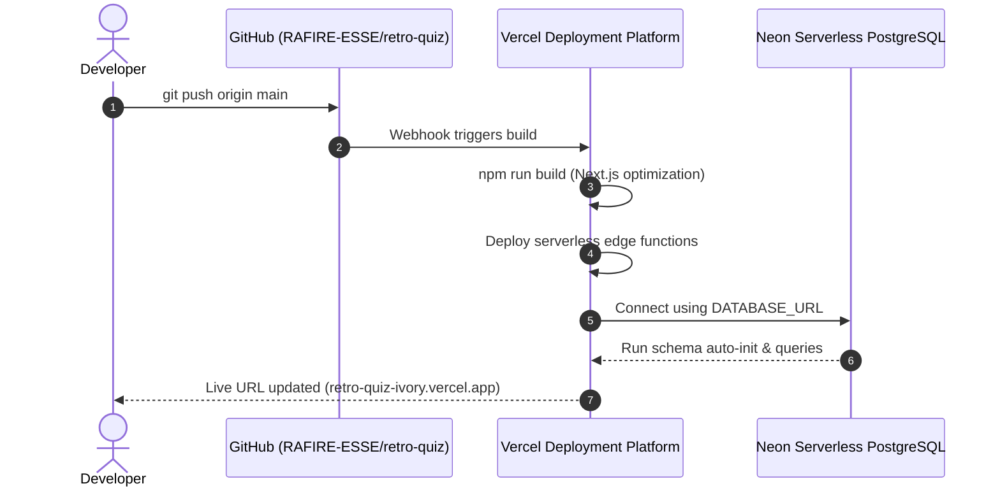

# 🕹️ Retro Quiz Arcade: Full System Architecture & Engineering Documentation

This document provides a comprehensive technical overview of the **Retro Vintage Quiz Arcade**, covering its end-to-end architecture across frontend rendering, game engine state, serverless backend route handlers, and cloud relational database (Neon Serverless PostgreSQL).

---

## 🏗️ 1. High-Level Architecture Overview

```mermaid
graph TD
    Client[Browser / User Device] -->|HTTPS Requests| VercelEdge[Vercel Serverless Edge Platform]
    
    subgraph Frontend [Next.js 14 App Router UI]
        Pages[App Pages: / , /quiz/:id, /results, /leaderboard, /builder]
        SoundEngine[Web Audio API 8-Bit Synthesizer]
        GameEngine[Synchronous Ref Game Engine]
    end

    subgraph Backend [Next.js Route Handlers]
        API_Quizzes["/api/quizzes (GET, POST)"]
        API_QuizId["/api/quizzes/:id (GET)"]
        API_Scores["/api/scores (GET, POST)"]
        API_Health["/api/health (GET)"]
        DB_Layer[lib/db.ts: Unified Cloud RDBMS Adapter]
    end

    subgraph Database [Cloud RDBMS: Neon PostgreSQL]
        QuizzesTable[(quizzes Table)]
        QuestionsTable[(questions Table)]
        ScoresTable[(scores Table)]
    end

    Client --> Frontend
    Frontend -->|Fetch API| Backend
    Backend --> DB_Layer
    DB_Layer -->|@neondatabase/serverless HTTP/TLS| Database
```

---

## 🎨 2. Design System & 4-Color Strict Palette

The application strictly implements a retro-vintage CRT arcade design using **only four high-contrast colors**:

| Color Code | Name | Role & Application |
|---|---|---|
| **`#360185`** | **Deep Indigo / Midnight Violet** | Primary background, card containers, primary header bars, and deep drop shadows. |
| **`#8F0177`** | **Bordeaux Plum / Magenta** | Secondary container backgrounds, borders, rationale highlight boxes, and option button bases. |
| **`#DE1A58`** | **Crimson Rose** | Accent stickers, high score badges, incorrect answer highlights, and warning banners. |
| **`#F4B342`** | **Warm Amber / Vintage Gold** | Primary readable typography, correct answer indicators, trophy icons, buttons, and high-visibility accents. |

### Aesthetic Features:
- **Zero External Audio Files**: 8-bit arcade coin drops, ticks, correct chimes, buzzers, and fanfare are synthesized dynamically in the browser using the **Web Audio API** (`lib/sound.ts`).
- **Hard Offset Retro Shadows**: Box shadows use zero blur and hard pixel offsets (`6px 6px 0px #DE1A58`).
- **CRT Scanlines**: Visual scanline filter evoking 1980s cathode-ray tube monitors.

---

## ⚡ 3. Game & Score Engine Architecture

Located in [`app/quiz/[id]/page.tsx`](file:///home/devil/Downloads/Quiz%20website/app/quiz/%5Bid%5D/page.tsx), the quiz engine runs with zero closure lag.

### A. Mathematical Scoring Formula
For every question answered correctly:
$$\text{Earned Points} = \text{round}\Big(\big(\text{Base Points} + \text{Speed Bonus}\big) \times \text{Streak Multiplier}\Big)$$

1. **Base Points**:
   - Flat **100 PTS** per correct question.
2. **Speed Bonus**:
   - **Standard & Sudden Death Modes**: $\text{Remaining Seconds} \times 10\text{ PTS}$ (e.g. answering in 3s with 12s remaining gives $12 \times 10 = 120\text{ PTS}$).
   - **Time Attack Blitz**: Flat **30 PTS** bonus (+3s added to global clock).
   - **Practice Mode**: 0 PTS (untimed).
3. **Streak Multiplier**:
   - **1 Streak**: $1.0\times$
   - **2–3 Streak**: $1.2\times$
   - **4–5 Streak**: $1.5\times$
   - **6+ Streak**: $2.0\times$
4. **Incorrect Answers**:
   - **0 PTS**, streak resets to 0. Blitz mode penalizes by $-2\text{s}$. Sudden Death triggers instant game over.

### B. State Synchronization & Race Condition Prevention
Previous implementations suffered from React closure capture issues where `setTimeout(() => advanceQuestion(), 1300)` on the final question captured stale `score` and `answersLog` arrays.

The engine uses synchronous mutable references (`useRef`):
- `scoreRef = useRef(0)`
- `streakRef = useRef(0)`
- `maxStreakRef = useRef(0)`
- `answersLogRef = useRef<AnswerLogItem[]>([])`
- `totalTimeSpentRef = useRef(0)`
- `currentIndexRef = useRef(0)`
- `isFinishingRef = useRef(false)`

When an answer is selected:
1. `pointsAwarded` is calculated immediately and added directly to `scoreRef.current`.
2. The question log is pushed synchronously into `answersLogRef.current`.
3. React states (`setScore`, `setStreak`, `setAnswersLog`) are updated strictly for HUD rendering.
4. When `finishQuiz()` executes, it constructs the payload directly from the references, guaranteeing **100% precision with zero dropped points or questions**.

---

## 🌐 4. Backend & API Route Handlers

The backend runs as serverless route handlers under Next.js App Router in `app/api/`:

### 1. `GET /api/quizzes` ([`app/api/quizzes/route.ts`](file:///home/devil/Downloads/Quiz%20website/app/api/quizzes/route.ts))
- Queries all active quizzes from the database.
- Uses `LEFT JOIN` and `COUNT(questions.id)` to compute question counts per cartridge.
- Returns `{ quizzes: [...] }`.

### 2. `POST /api/quizzes` ([`app/api/quizzes/route.ts`](file:///home/devil/Downloads/Quiz%20website/app/api/quizzes/route.ts))
- Accepts a new cartridge payload: `{ title, description, category, icon, questions: [...] }`.
- Generates a unique, URL-safe slug.
- Inserts quiz into `quizzes` table and all child questions into `questions` table using transaction safety.
- Returns `{ success: true, quiz: { id, slug, ... } }` with HTTP 201.

### 3. `GET /api/quizzes/[id]` ([`app/api/quizzes/[id]/route.ts`](file:///home/devil/Downloads/Quiz%20website/app/api/quizzes/%5Bid%5D/route.ts))
- Accepts either a numeric ID or string slug (`/api/quizzes/retro-tech` or `/api/quizzes/1`).
- Returns the quiz metadata along with an ordered array of its questions.

### 4. `GET /api/scores` ([`app/api/scores/route.ts`](file:///home/devil/Downloads/Quiz%20website/app/api/scores/route.ts))
- Accepts optional `?limit=N` query param (default: 30, max: 100).
- Performs a `LEFT JOIN` between `scores` and `quizzes` with `COALESCE(quizzes.title, scores.quiz_title, 'Retro Cartridge')`.
- Returns `{ scores: [...] }` sorted by score descending.

### 5. `POST /api/scores` ([`app/api/scores/route.ts`](file:///home/devil/Downloads/Quiz%20website/app/api/scores/route.ts))
- Accepts `{ quizId, quizTitle, gamerTag, score, accuracy, maxStreak, gameMode, timeSpentSeconds }`.
- Sanitizes gamer tags to uppercase alphanumeric characters (`A-Z, 0-9, _`).
- Inserts record into `scores` and returns `{ success: true, score: { id, playedAt, ... } }`.

### 6. `GET /api/health` ([`app/api/health/route.ts`](file:///home/devil/Downloads/Quiz%20website/app/api/health/route.ts))
- Diagnostic endpoint reporting active database mode (`neon_postgres` or `mssql`), server status, and live row counts.

---

## 🗄️ 5. Cloud Database Architecture (Neon PostgreSQL)

The primary cloud database is **Neon Serverless PostgreSQL**, connected through `@neondatabase/serverless` over secure HTTP/WebSocket transport.

### Database Schema Definition
```sql
-- 1. Quizzes Table
CREATE TABLE IF NOT EXISTS quizzes (
  id SERIAL PRIMARY KEY,
  slug VARCHAR(100) UNIQUE NOT NULL,
  title VARCHAR(200) NOT NULL,
  description TEXT NOT NULL,
  category VARCHAR(50) NOT NULL,
  icon VARCHAR(10) DEFAULT '🕹️',
  difficulty VARCHAR(20) DEFAULT 'medium',
  is_custom BOOLEAN DEFAULT false,
  created_at TIMESTAMP WITH TIME ZONE DEFAULT NOW()
);
CREATE INDEX IF NOT EXISTS ix_quizzes_slug ON quizzes(slug);

-- 2. Questions Table
CREATE TABLE IF NOT EXISTS questions (
  id SERIAL PRIMARY KEY,
  quiz_id INT NOT NULL REFERENCES quizzes(id) ON DELETE CASCADE,
  question_text TEXT NOT NULL,
  code_snippet TEXT,
  option_a TEXT NOT NULL,
  option_b TEXT NOT NULL,
  option_c TEXT NOT NULL,
  option_d TEXT NOT NULL,
  correct_option INT NOT NULL,
  explanation TEXT NOT NULL,
  difficulty VARCHAR(20) DEFAULT 'medium'
);
CREATE INDEX IF NOT EXISTS ix_questions_quiz_id ON questions(quiz_id);

-- 3. High Scores / Leaderboard Table
CREATE TABLE IF NOT EXISTS scores (
  id SERIAL PRIMARY KEY,
  quiz_id INT,
  quiz_title VARCHAR(200),
  gamer_tag VARCHAR(50) NOT NULL,
  score INT NOT NULL,
  accuracy INT NOT NULL,
  max_streak INT DEFAULT 0,
  game_mode VARCHAR(30) DEFAULT 'standard',
  time_spent_seconds INT DEFAULT 0,
  played_at TIMESTAMP WITH TIME ZONE DEFAULT NOW()
);
CREATE INDEX IF NOT EXISTS ix_scores_score ON scores(score DESC);
CREATE INDEX IF NOT EXISTS ix_scores_played_at ON scores(played_at DESC);
```

### Self-Healing Auto-Initialization
When the application starts or receives its first query:
1. `initNeonDatabase()` in [`lib/db.ts`](file:///home/devil/Downloads/Quiz%20website/lib/db.ts) verifies all three tables and indexes exist.
2. If `quizzes` has 0 rows, it automatically seeds the 4 default retro cartridges.
3. If `scores` has 0 rows, it automatically seeds the initial arcade Hall of Fame records.

---

## 🚀 6. CI/CD & Deployment Workflow



---

## 📁 7. Repository File Map

```
├── app/
│   ├── api/
│   │   ├── health/route.ts       # Database connectivity inspector
│   │   ├── quizzes/route.ts      # List & create quizzes
│   │   ├── quizzes/[id]/route.ts # Fetch single quiz by slug/id
│   │   └── scores/route.ts       # Leaderboard query & submission
│   ├── builder/page.tsx          # Cartridge Creator (Custom Quizzes)
│   ├── leaderboard/page.tsx      # Global Hall of Fame rankings
│   ├── quiz/[id]/page.tsx        # Real-time arcade quiz gameplay engine
│   ├── results/page.tsx          # Score certificate & answer rationale log
│   ├── globals.css               # Retro arcade CRT styles & color tokens
│   ├── layout.tsx                # Root layout with header & scanlines
│   └── page.tsx                  # Arcade homepage with game mode selector
├── components/
│   ├── RetroIcons.tsx            # Hand-crafted retro arcade SVG icons
│   └── RetroTransition.tsx       # Pixel wipe screen transitions
├── database/
│   ├── schema.sql                # SQL schema reference
│   └── seed.sql                  # Seed data script
├── lib/
│   ├── db.ts                     # Unified Neon PostgreSQL / MS SQL client
│   ├── seedData.ts               # Default questions & leaderboard data
│   └── sound.ts                  # Web Audio API 8-bit sound synthesizer
├── .env.example                  # Environment variable reference
├── package.json                  # Dependencies & scripts
└── README.md                     # Quickstart documentation
```
